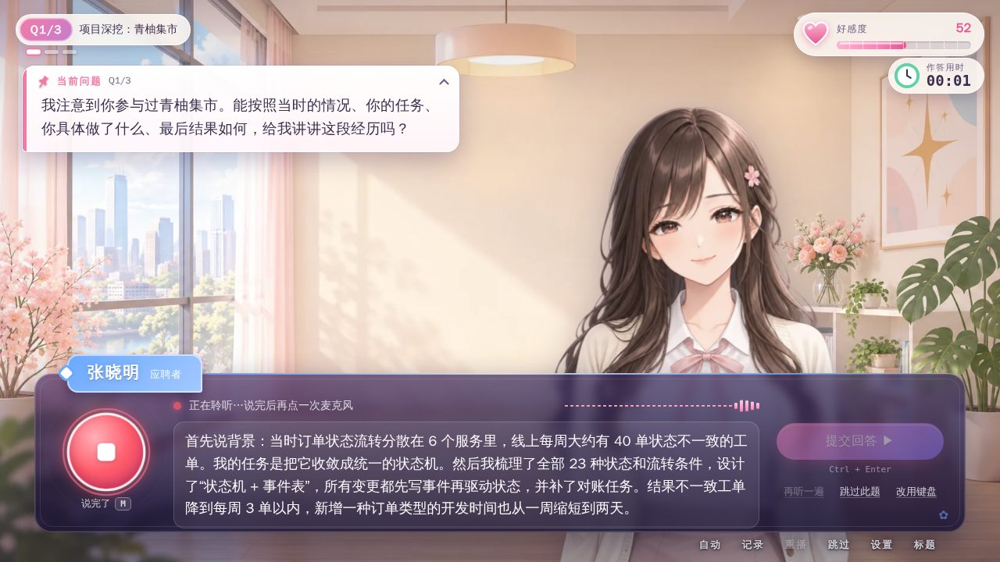
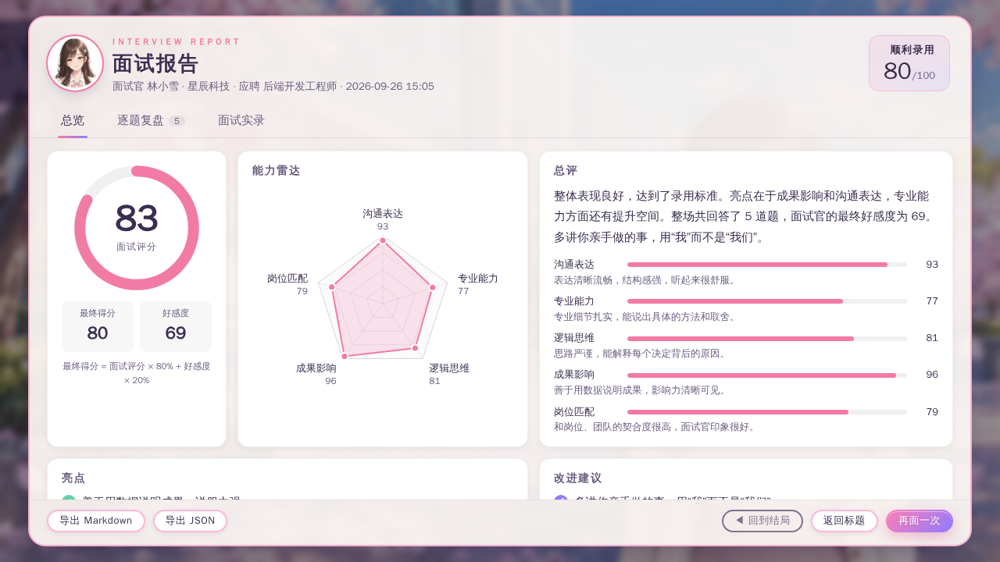
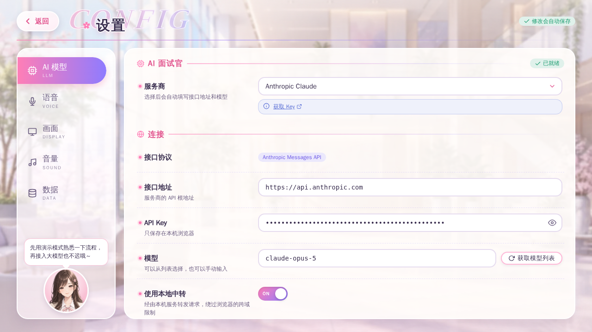
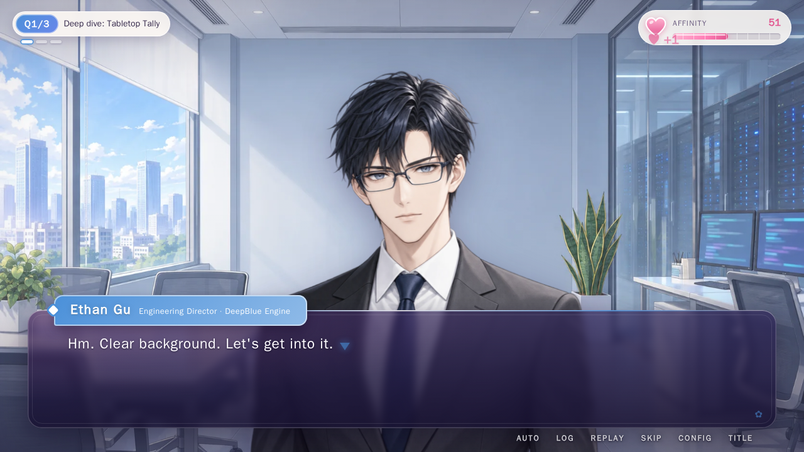

<div align="center">

# 面试物语 · Interview Story

**~ Offer Get! ~**

galgame 风格的 AI 模拟面试：上传简历，挑一位面试官，用语音完成一场有追问、有好感度、有结局的面试。<br>
A galgame-style AI mock interview: upload your résumé, pick an interviewer, and talk your way to one of four endings.

[中文](#中文) · [English](#english)


</div>

| | |
|:-:|:-:|
|  |  |
| 标题画面 · Title | 选择面试官 · Choose your interviewer |
|  |  |
| 语音作答 · Answering by voice | 结局 CG · Ending CG |
|  |  |
| 面试报告 · Report | 设置：AI 模型 · Settings: LLM |

---

## 中文

- [功能亮点](#功能亮点)
- [快速开始](#快速开始)
- [生产部署](#生产部署)
- [配置大模型](#配置大模型)
- [配置语音](#配置语音)
- [一场面试是怎么进行的](#一场面试是怎么进行的)
- [隐私说明](#隐私说明)
- [项目结构](#项目结构)
- [开发](#开发)
- [许可证](#许可证)

### 功能亮点

- **galgame 式演出**：会眨眼、会呼吸、口型跟着语音动的立绘（7 种表情），打字机对话框，章节标题卡（序章 / 第 N 幕 / 终章 / 尾声），好感度仪表，樱花飘落，对话记录、自动播放与重播语音。
- **三位面试官**，性格、提问风格和声线各不相同：

  | 面试官 | 身份 | 默认风格 | 严格度 |
  |---|---|---|---|
  | 林小雪 Yuki | 星辰科技 · HR 经理 | 行为面 | ★★☆☆☆ |
  | 顾言深 Ethan | 深蓝引擎 · 技术总监 | 技术面 | ★★★★☆ |
  | 夏晴 Haru | 晴空实验室 · 创始人 & CEO | 综合面 | ★★★☆☆ |

- **基于简历的提问与追问**：支持 PDF / DOCX / TXT / Markdown 简历（也可以粘贴文本或用示例简历），可填写目标岗位和职位描述（JD）。面试官先读简历、定好面试计划，主问题紧扣你写过的项目、技能和数字；追问会引用你刚刚回答里的细节。
- **语音问答**：面试官的话由 TTS 朗读（浏览器语音或 API 语音），你对着麦克风回答（浏览器识别，或 Whisper / SenseVoice 等 API 识别），随时可以改用键盘输入。
- **好感度与 4 种结局**：每个回答都会被私下打分并影响好感度，最终得分决定「完美内定 / 顺利录用 / 等待通知 / 擦肩而过」，配有结局 CG 和盖章动画。
- **面试报告与导出**：总分、五维能力雷达（沟通表达 / 专业能力 / 逻辑思维 / 成果影响 / 岗位匹配）、亮点与改进建议、逐题复盘（得分、点评、参考回答）、完整面试实录；可导出 Markdown 或 JSON。
- **面试记录与结局回廊**：最近 30 场面试可以随时回看；3 位面试官 × 4 种结局，共 12 张结局卡等你收集。
- **中英双语**：界面语言和面试语言分开设置，提问、朗读和识别都跟随面试语言。
- **离线演示模式**：默认使用内置的脚本面试官，不需要 API Key，也不需要联网；它同样会从简历里提取关键词来提问、追问和打分，并生成完整报告。
- **精美立绘与背景**：三位面试官的立绘与全部场景由 AI 绘制（Codex CLI 的图像生成），表情、口型与眨眼都是同一张立绘上逐帧对齐的图层；音乐和音效由 Web Audio 实时合成。所有素材随游戏打包，不依赖 CDN 或在线字体，在中国大陆也能完整运行。

### 快速开始

需要 **Node.js ≥ 22.18**。

```bash
npm install
npm run dev
```

打开 <http://127.0.0.1:5173>，点「开始面试」→ 选面试官 →「使用示例简历」→「开始面试」。默认是离线演示模式，什么都不用配置；想让真正的大模型来面试你，请到「设置 → AI 模型」里选择服务商并填写 API Key。

画面是固定的 16:9 舞台。在竖着拿的手机上会先出现「请横屏游玩」的提示，可以点「仍然竖屏继续」关掉（刷新前不再出现）。

### 生产部署

```bash
npm run build   # 类型检查 + 打包到 dist/
npm start       # 用 Node 直接运行 server/index.ts：托管 dist/ 并提供本地中转
```

默认监听 <http://127.0.0.1:4173>，可以用环境变量修改：

```bash
HOST=0.0.0.0 PORT=8080 npm start
# 用域名访问（局域网主机名、反向代理之后）时，要把域名加进 ALLOWED_HOSTS：
ALLOWED_HOSTS=game.example.com HOST=0.0.0.0 npm start
```

本地中转（`/api/proxy/…`）的保护措施：

- **只认本机地址**：请求的 `Host` 必须是 `localhost` / `*.localhost`、IP 地址，或者列在环境变量 `ALLOWED_HOSTS` 里的域名（逗号分隔；写成 `.example.com` 表示连同所有子域名），否则返回 403。这可以挡住 DNS 重绑定攻击。通过域名访问游戏时（局域网主机名、反向代理），必须设置它，否则 AI 与 API 语音请求都会被拒绝。开发服务器（`npm run dev`）也读取这个变量。
- 请求必须带 `x-interview-proxy: 1` 头，且来自同源页面；只转发 http/https。
- 请求体上限 32 MB，超过直接返回 413，不会发往上游。
- 上游的响应头只放行白名单（内容类型、缓存、重试提示、请求 ID、`anthropic-*` / `openai-*` / `x-ratelimit-*` 等），`Set-Cookie`、`Clear-Site-Data`、CSP 之类都会被丢掉。

> [!WARNING]
> 中转会把请求转发到**任意** http/https 地址，并不做身份认证。把 `HOST` 设为非本机地址后，能访问这个端口的任何人都可以把你的服务器当作开放代理使用（用 IP 地址访问也算本机地址），服务器启动时也会打印一条警告。请只在可信网络内这样做，或者在前面加上认证。

`dist/` 也可以直接放到任意静态托管上。那种情况下没有中转，所有请求都从浏览器直接发出，只有允许跨域（CORS）的服务商可用（见下表）。

### 配置大模型

在「设置 → AI 模型」里选择服务商，会自动填好接口地址和默认模型，每一项都还可以手动修改。「获取模型列表」会读取服务商的 `/models` 接口，「测试连接」会发一条很短的请求并显示耗时和回复。

| 预设 | 协议 | 接口地址 | 默认模型 | 说明 |
|---|---|---|---|---|
| 演示模式 | — | — | — | 默认。离线脚本面试官 |
| Anthropic Claude | Anthropic | `https://api.anthropic.com` | `claude-opus-5` | 另有 `claude-sonnet-5`、`claude-haiku-4-5`、`claude-fable-5-1` |
| OpenAI | OpenAI 兼容 | `https://api.openai.com/v1` | `gpt-5-mini` | |
| DeepSeek 深度求索 | OpenAI 兼容 | `https://api.deepseek.com/v1` | `deepseek-flash` | 需要中转；另有 `deepseek-v4-pro` |
| 通义千问 Qwen（阿里云百炼） | OpenAI 兼容 | `https://dashscope.aliyuncs.com/compatible-mode/v1` | `qwen-plus` | 需要中转；国际站用 `dashscope-intl.aliyuncs.com` |
| Kimi（月之暗面） | OpenAI 兼容 | `https://api.moonshot.cn/v1` | `kimi-k2.6` | 需要中转；另有 `kimi-k3`、`kimi-k2.7-code`；Key 在 [platform.kimi.com](https://platform.kimi.com/console/api-keys) |
| 智谱 GLM | OpenAI 兼容 | `https://open.bigmodel.cn/api/paas/v4` | `glm-4.5-air` | 需要中转 |
| 硅基流动 SiliconFlow | OpenAI 兼容 | `https://api.siliconflow.cn/v1` | `deepseek-ai/DeepSeek-V3` | 需要中转 |
| OpenRouter | OpenAI 兼容 | `https://openrouter.ai/api/v1` | `google/gemini-2.5-flash` | |
| Ollama（本地模型） | OpenAI 兼容 | `http://localhost:11434/v1` | `qwen2.5:7b` | 无需 Key，见下文 |
| 自定义（OpenAI 兼容） | OpenAI 兼容 | 你的 `…/v1` | — | 请求 `{地址}/chat/completions` |
| 自定义（Anthropic 兼容） | Anthropic | 不含 `/v1` 的根地址 | — | 请求 `{地址}/v1/messages` |

「需要中转」表示该服务商一般不允许浏览器直接跨域调用，必须通过本地中转（`npm run dev` / `npm start` 自带，默认开启）。

DeepSeek 的 `deepseek-chat` / `deepseek-reasoner` 已于 2026-07-24 下线，Kimi 的 kimi-k2 预览版、`kimi-latest` 和 `moonshot-v1-*` 也已下线。旧设置里还填着这些模型时，游戏会提示「找不到模型或接口」，点「获取模型列表」换一个即可。

**Anthropic Claude**
- 使用官方 SDK（浏览器模式）。默认模型 `claude-opus-5`，「思考力度」可选 低 / 中 / 高（默认低，响应更快）。
- 开启 JSON 模式时使用结构化输出（`output_config.format`，由游戏的 zod 模式生成 JSON Schema，枚举值也会强制校验）。系统提示词在整场面试中保持不变，对话历史也带有第二个缓存断点，都可以命中提示词缓存。
- **拒答回退**：在官方地址上使用 Claude Opus 5 或 Fable 系列模型时，请求会带上服务端回退（`fallbacks: "default"`，beta 头 `server-side-fallback-2026-07-01`）。如果模型因安全策略拒绝了某次请求，API 会在同一次调用内自动换用回退模型重新生成；只有整条回退链都拒绝时，游戏才会弹出「面试官拒绝回答」，面试进度不会丢失，点「重试」即可。
- 第三方 Anthropic 兼容接口如果不支持 `output_config`（返回 400），会自动去掉它重试一次，并在本次会话中记住。

**OpenAI 兼容服务**：请求 `POST {地址}/chat/completions`，JSON 模式下带 `response_format: {type: "json_object"}`。个别第三方接口不支持 JSON 模式时，可以在「高级」里关掉；无论开关与否，游戏都会自己校验和修复模型返回的 JSON。

- **温度**：滑块只覆盖服务商接受的范围：Kimi 和智谱 GLM 为 0–1，通义千问（DashScope）为 0–1.9，其余为 0–2；超出范围的旧值会按范围截断后发送。OpenAI 推理模型（o 系列、GPT-5）和 Kimi K2.5 及之后的模型使用固定温度，游戏不发送温度，设置里显示说明而不是滑块。
- **输出长度**：OpenAI 兼容接口的输出上限（包括回复被截断后的那次重试）不超过 8192 token；如果接口在 400 错误里说明了更低的上限，游戏会按它重试并记住。Claude 的上限是 16000。

**Ollama**：先 `ollama pull qwen2.5:7b`（或其他模型），再选「Ollama（本地模型）」。开启中转时直接可用；关闭中转直连时，如果浏览器报跨域错误，请用 `OLLAMA_ORIGINS=*` 启动 Ollama。

**为什么需要本地中转？** 大多数模型和语音 API 不允许网页直接跨域调用（CORS）。开发服务器和 `npm start` 都自带一个中转：前端把 `https://host/v1/x` 改写成 `/api/proxy/https/host/v1/x`，由本机 Node 进程转发并流式返回。API Key 随每次请求一起发出，中转不做任何保存。启动时游戏会请求 `GET /api/health` 检测中转是否可用；不可用（例如静态托管）时自动直连。

**API Key 只保存在本浏览器的 localStorage 里**，只会发给你配置的接口地址（开启中转时经由本机转发）。切换到其他服务商时，旧 Key 只会在新地址与旧地址同主机时保留，不会被误发给别的服务商。

### 配置语音

「设置 → 语音」里分别设置面试官语音（TTS）和语音识别（STT）。开始面试前的「设备检查」可以试听语音、测试麦克风。

**浏览器内置引擎支持情况**

| | Chrome | Edge | Safari | Firefox |
|---|---|---|---|---|
| 浏览器语音（TTS） | 支持（含 Google 在线语音） | 支持（Microsoft 自然语音，效果最好） | 支持（系统语音） | 支持（系统语音） |
| 浏览器识别（STT） | 支持，但依赖 Google 服务器 | 支持 | 支持，效果因系统而异 | 不支持 |
| API 识别（录音上传） | 支持 | 支持 | 支持 | 支持 |

- **在中国大陆**：Chrome 的内置识别需要访问 Google 服务器，通常无法使用。请改用 **Microsoft Edge**，或者把识别引擎换成「API 识别」（例如硅基流动 SenseVoice，国内可直接访问）。
- 麦克风需要安全上下文：`localhost` / `127.0.0.1` 或 HTTPS。
- 浏览器识别会实时显示识别中的文字；API 识别在你说完后才上传转写，期间显示录音计时和音量波形。
- 可以打开「识别后自动提交」；关闭时可以先修改识别出的文字再提交。
- **API 识别失败时录音会保留**：状态栏会说明具体原因（限流 429、Key 错误 401/403、地址或模型不对 404、服务器错误 5xx、超时、网络或中转不通），点「重新识别」即可重新上传，不用再说一遍；也可以改用键盘。
- **iPhone / iPad**：iOS 只允许在点击之后开始朗读。游戏会在你第一次点击或按键时悄悄解锁语音（一段无声的朗读和一段无声的音频），之后面试官就能正常说话。
- 浏览器语音偶尔失败时，这一句会换一个声音重试；失败的声音 3 分钟内不会被自动选中，你在设置里选定的声音仍会优先使用（连续失败两次后才暂时换掉）。

**API 预设**（均为 OpenAI 兼容格式）

| 类型 | 预设 | 接口地址 | 默认模型 |
|---|---|---|---|
| TTS | OpenAI TTS | `https://api.openai.com/v1` | `gpt-4o-mini-tts`（另有 `tts-1`、`tts-1-hd`） |
| TTS | 硅基流动 CosyVoice2 | `https://api.siliconflow.cn/v1` | `FunAudioLLM/CosyVoice2-0.5B` |
| TTS | 自定义 | 任意 `/audio/speech` 接口 | — |
| STT | OpenAI Whisper | `https://api.openai.com/v1` | `whisper-1`（另有 `gpt-4o-mini-transcribe`、`gpt-4o-transcribe`） |
| STT | Groq Whisper（极速） | `https://api.groq.com/openai/v1` | `whisper-large-v3-turbo` |
| STT | 硅基流动 SenseVoice | `https://api.siliconflow.cn/v1` | `FunAudioLLM/SenseVoiceSmall` |
| STT | 自定义 | 任意 `/audio/transcriptions` 接口 | — |

- 音色留空时使用每位面试官的默认音色（OpenAI：小雪 `nova`、言深 `onyx`、夏晴 `shimmer`；CosyVoice2：`anna` / `alex` / `bella`）。
- API 语音调用失败时，这一句会自动改用浏览器语音朗读。语音会预取和缓存，翻页时几乎没有等待。
- **键盘兜底**：识别引擎选「键盘输入」即可完全不用麦克风；面试中也可以随时点「改用键盘」。TTS 选「关闭」时只显示文字，自动播放仍按阅读时间翻页。

### 一场面试是怎么进行的

1. **准备**：面试官阅读简历，制定面试计划（候选人、岗位、亮点与疑点、主问题话题、开场白）。
2. **序章**：打招呼，请你做自我介绍。
3. **第 N 幕**：按计划依次提问，共 3–12 个主问题（默认 5 个）。每个主问题之后最多追问 0–3 次（默认 2 次）：还有追问次数且你没有跳过时，由面试官决定是继续追问还是进入下一题。
4. **终章 · 反问时间**：「你有什么想问我们的吗？」面试官会以角色身份回答。点「没有问题了」结束，或者问满 3 个问题后自动结束。演示模式下，直接说「没有其他问题了」或者只是道谢、寒暄，也会结束反问（不占提问次数）。
5. **尾声**：面试官道别。
6. **评估**：生成面试报告，计算结局，保存记录并解锁结局卡。

其他选项：面试语言（中文 / English）、目标岗位（留空则从简历推断）、职位描述、面试风格（行为面 / 技术面 / 综合面）、难度（轻松 / 标准 / 困难）、作答时限（不限 / 60 / 120 / 180 秒）。每一步都会自动存档，中途退出后可以在标题画面「继续面试」；任何 AI 请求失败都可以原地重试，不会丢失进度。如果浏览器存储已满或不可用，会弹出「进度没能保存」的提示：这时进度只保留在当前页面。

**作答**

- 语音作答时，麦克风是「追加」的：已经有回答（识别出的、改过的或打的字）时，按钮会变成「继续补充」，新说的内容接在原回答的下一行。只有「重新录音」会先清空原回答。
- **作答时限**：倒计时从面试官念完问题（或你开始作答：点麦克风、打第一个字）时开始，最晚在出现作答面板 15 秒后开始；暂停、打开设置或隐藏界面时会冻结，回来后接着倒数。时间到会停止录音并提交已说的内容（什么都没说则跳过本题）。
- **暂停**：打开暂停菜单（Esc）、对话记录（L）、返回标题的确认框或错误对话框时，整个场景会暂停：打字机和面试官的语音停下，问题不会提前交给你；正在录音会停止，已识别的内容留在输入框里可以修改，即使开了「识别后自动提交」也不会提交；倒计时冻结，不会自动提交或跳过。关闭菜单后焦点回到输入框。

**评分、好感度与结局**（由引擎确定性计算）

- 每个回答（自我介绍、主问题、追问）由面试官私下打 0–10 分，不会在对话中说出来。
- 好感度从 **50** 开始，范围 0–100；每个回答变化最多 ±10，反问环节每次最多 ±5，跳过问题记 0 分且好感度 −6。
- 报告给出 0–100 的面试评分；**最终得分 = round(0.8 × 面试评分 + 0.2 × 好感度)**。
- 面试评分以面试中的逐题得分为准（演示模式和大模型模式完全一致）：先按话题求平均（自我介绍单独一组，主问题和它的追问算一个话题，免得弱项因为被追问而重复计算），再对各话题求平均，然后按评分曲线换算成 0–100：**5 分 ≈ 55，6 ≈ 65，7 ≈ 75，8 ≈ 84，9 ≈ 92**。报告给出的面试评分最多偏离这个参考值 ±15，并且会落在参考值所对应结局的分数区间内，所以结局由「话题平均分 + 好感度」决定。

| 结局 | 条件 |
|---|---|
| 完美内定 Perfect Offer | 最终得分 ≥ 90 **且** 好感度 ≥ 80 |
| 顺利录用 Offer Get! | 最终得分 ≥ 75 |
| 等待通知 On the Waitlist | 最终得分 ≥ 60 |
| 擦肩而过 Not This Time | 最终得分 < 60 |

换算成话题平均分（0–10），达到各结局所需的平均分（向上取一位小数）：

| 好感度 | 等待通知 | 顺利录用 | 完美内定 |
|---|---|---|---|
| 50（初始值） | 5.7 | 7.7 | — |
| 65 | 5.4 | 7.2 | — |
| 80 | 5.0 | 6.9 | 9.0 |
| 100 | 4.5 | 6.4 | 8.4 |

**操作按键**：空格 / 回车 / 点击 = 下一页，`Esc` = 暂停菜单，`L` = 对话记录，`A` = 自动播放，`M` = 开始 / 停止录音，`Ctrl + Enter` = 提交回答。

### 隐私说明

- 没有后端账号，也没有统计埋点。以下数据都只保存在本浏览器的 localStorage 里：设置（含 API Key，`igg.settings.v1`）、未完成面试的自动存档（含完整简历和问答，`igg.session.v1`）、面试记录（最多 30 条，简历截取前 4000 字，`igg.records.v1`）、结局解锁状态（`igg.endings.v1`），以及准备页记住的面试官和选项（面试语言、目标岗位、职位描述等，不含简历，`igg.setup.v1`）。
- 「设置 → 数据」可以分别清除：清空记录、重置结局、删除存档（中断的面试；面试进行中时不可用）、清除面试准备数据（`igg.setup.v1` 和准备页里仍载入的简历）、恢复默认设置（包括 API Key，记录、结局、存档和准备数据保留），或者「清除全部本地数据」一次清空以上所有内容（面试进行中时不可用）。
- 本次打开页面期间完成的面试会在内存里保留完整简历，「再面一次」时直接使用；刷新后打开的旧记录只有截取后的简历，准备页会停在第 2 步并提示你重新上传。
- 演示模式下简历和回答不会离开浏览器。接入大模型后，简历、职位描述和面试对话会发送给你配置的服务商。
- 语音同理：API 语音 / 识别会把面试官台词或你的录音发给对应接口；浏览器识别由浏览器厂商的服务处理（Chrome 为 Google，Edge 为 Microsoft），浏览器的「在线」语音也会联网合成。
- 本地中转只转发请求，不保存也不记录请求内容。

### 项目结构

```text
├─ server/
│  ├─ index.ts        # 生产服务器：托管 dist/ + /api/*（npm start）
│  ├─ proxy.ts        # 本地中转：/api/health、/api/proxy/{http|https}/{host}/{path}
│  └─ static.ts       # 静态文件路径解析（防目录穿越）
├─ src/
│  ├─ App.tsx         # 1280×720 舞台、画面切换（按需加载）、启动检测
│  ├─ types.ts        # 模块之间共享的类型契约
│  ├─ characters.ts   # 三位面试官：人设、声线、配色
│  ├─ ai/             # 面试官大脑：LLM 版（提示词、zod 校验）与离线演示版
│  ├─ engine/         # 纯函数规则：出题指令、评分、结局、存档
│  ├─ store/          # zustand：game（面试流程）与 settings
│  ├─ llm/            # 传输层：Anthropic SDK、OpenAI 兼容 fetch、预设、错误映射
│  ├─ speech/         # TTS（浏览器 / API / 关闭）与 STT（浏览器 / API）
│  ├─ resume/         # PDF / DOCX / TXT / MD 解析，示例简历
│  ├─ audio/          # Web Audio 合成的 BGM 与音效
│  ├─ art/            # 立绘（表情 / 口型 / 眨眼图层）、背景、特效；素材在 art/assets/
│  ├─ screens/        # 标题、准备、面试、结果、记录、结局回廊、设置
│  ├─ components/     # 对话框、HUD、作答面板、报告、UI 组件
│  ├─ i18n/           # 中英文案（两种语言的键完全一致）
│  └─ styles/         # 全局样式变量
├─ tests/e2e/         # Playwright 端到端测试
├─ tools/art/         # 美术管线：用 Codex CLI 生成立绘 / 背景并打包（见 tools/art/README.md）
└─ docs/              # DESIGN.md（设计规格）与截图
```

更详细的设计说明见 [docs/DESIGN.md](docs/DESIGN.md)。

### 开发

| 命令 | 作用 |
|---|---|
| `npm run dev` | 开发服务器（含中转），<http://127.0.0.1:5173> |
| `npm run build` | 类型检查并打包到 `dist/` |
| `npm start` | 运行生产服务器（先 build），默认 <http://127.0.0.1:4173> |
| `npm run preview` | `build` + `start` |
| `npm run typecheck` | `tsc -b --noEmit` |
| `npm run lint` | ESLint |
| `npm test` | Vitest 单元 / 组件测试（`npm run test:watch` 为监听模式） |
| `npm run test:e2e` | Playwright 端到端测试 |

**测试说明**
- 单元测试与源码放在一起（`*.test.ts(x)`），默认 `node` 环境；组件测试文件以 `// @vitest-environment jsdom` 开头。
- 测试不访问网络：AI、语音和音频都有替身（`src/ai/__fixtures__`、`src/speech/testing`、`src/audio/testing`），演示面试官可以用 `setDemoDelay(0)` 去掉人为延迟。
- E2E 用 Chromium 运行：`chromium` 项目会在 5199 端口自己启动一个关闭了 HMR 的 Vite，配合假的麦克风、浏览器语音替身（`tests/e2e/support/fakeSpeech.ts`）和本地模拟的 OpenAI 兼容服务（`tests/e2e/support/mockLlm.ts`），不会调用真实 API；`prod` 项目会先 `npm run build`，再对 `node server/index.ts` 做冒烟测试。第一次运行前请先执行 `npx playwright install chromium`。
- 开发模式下 `window.__stores = { game, settings }` 暴露了两个 store，方便调试和为 E2E 预置数据。在网址后加 `?screen=artPreview` 可以打开立绘与背景的美术检查页。

### 许可证

MIT © the authors

---

## English



- [Features](#features)
- [Quick start](#quick-start)
- [Production](#production)
- [LLM configuration](#llm-configuration)
- [Voice configuration](#voice-configuration)
- [How an interview works](#how-an-interview-works)
- [Privacy](#privacy)
- [Project structure](#project-structure)
- [Development](#development)
- [License](#license)

### Features

- **Galgame presentation**: sprites that blink, breathe and lip-sync (7 expressions each), a typewriter dialogue box, chapter title cards (Prologue / Act N / Finale / Epilogue), an affinity meter, falling sakura, a backlog, auto mode and voice replay.
- **Three interviewers** with their own personality, questioning style and voice:

  | Interviewer | Role | Default style | Strictness |
  |---|---|---|---|
  | Yuki Lin | HR Manager, Stellar Tech | Behavioral | ★★☆☆☆ |
  | Ethan Gu | Engineering Director, DeepBlue Engine | Technical | ★★★★☆ |
  | Haru Xia | Founder & CEO, Clearsky Labs | Mixed | ★★★☆☆ |

- **Résumé-grounded questions and follow-ups**: PDF / DOCX / TXT / Markdown résumés (or paste text, or use a sample), plus an optional target role and job description. The interviewer reads your résumé and plans the interview first; main questions are built on your actual projects, skills and numbers, and follow-ups pick up specifics from the answer you just gave.
- **Voice Q&A**: the interviewer speaks through TTS (browser voices or an API), you answer into the microphone (browser recognition, or an API such as Whisper or SenseVoice), and you can switch to the keyboard at any time.
- **Affinity and four endings**: every answer is scored privately and moves the interviewer's affinity; your final score decides between Perfect Offer, Offer Get!, On the Waitlist and Not This Time, each with an ending CG and a stamp animation.
- **Report and export**: overall score, a five-axis radar (Communication / Expertise / Logic / Impact / Fit), strengths and improvements, a per-question review (score, feedback, a better answer) and the full transcript; export as Markdown or JSON.
- **Records and endings gallery**: revisit your last 30 interviews; collect all 12 ending cards (3 interviewers × 4 endings).
- **Chinese and English**: the UI language and the interview language are set separately; questions, speech and recognition follow the interview language.
- **Offline demo mode**: the default interviewer is a built-in scripted one that needs no API key and no network. It still pulls keywords from your résumé to ask, follow up, score and write a full report.
- **Painted art, no external assets**: the three interviewers and every scene are painted with AI image generation (the Codex CLI's image tool); expressions, lip-sync and blinks are pixel-aligned layers over one sprite. Music and sound effects are synthesized with Web Audio. Everything ships with the game (no CDNs, no web fonts), so it works fully in mainland China too.

### Quick start

Requires **Node.js ≥ 22.18**.

```bash
npm install
npm run dev
```

Open <http://127.0.0.1:5173>, then New Interview → pick an interviewer → Use sample résumé → Start Interview. The game starts in offline demo mode with nothing to configure. For a real AI interviewer, choose a provider and enter an API key under Config → AI Model.

The game is a fixed 16:9 stage. On a phone held upright a "Rotate your device" hint appears first; "Continue in portrait" dismisses it until the next reload.

### Production

```bash
npm run build   # type-check + bundle into dist/
npm start       # run server/index.ts with Node: serves dist/ and the local relay
```

It listens on <http://127.0.0.1:4173> by default. Use environment variables to change that:

```bash
HOST=0.0.0.0 PORT=8080 npm start
# Reached through a host name (a LAN name, a reverse proxy)? Add it to ALLOWED_HOSTS:
ALLOWED_HOSTS=game.example.com HOST=0.0.0.0 npm start
```

How the local relay (`/api/proxy/…`) protects itself:

- **Local host names only**: the request's `Host` must be `localhost` / `*.localhost`, an IP address, or a name listed in the `ALLOWED_HOSTS` environment variable (comma-separated; `.example.com` also covers its subdomains). Anything else gets a 403. This blocks DNS-rebinding attacks. If you reach the game through a host name (a LAN name, a reverse proxy), you must set it, or every AI and API-speech request is refused. The dev server (`npm run dev`) reads the same variable.
- Requests must carry the `x-interview-proxy: 1` header and come from the game's own origin; only http/https upstreams are allowed.
- Request bodies are capped at 32 MB; larger ones get a 413 and never reach the upstream.
- Only an allow-list of upstream response headers is passed on (content type, caching, retry hints, request ids, `anthropic-*` / `openai-*` / `x-ratelimit-*`…); `Set-Cookie`, `Clear-Site-Data`, CSP and the like are dropped.

> [!WARNING]
> The relay forwards requests to **any** http/https URL and has no authentication. If you bind `HOST` to anything other than localhost, anyone who can reach the port can use your server as an open proxy (an IP address always counts as a local host), and the server prints a warning on startup. Only do this on a trusted network, or put authentication in front of it.

You can also put `dist/` on any static host. There is no relay then: requests go straight from the browser, so only providers that allow CORS will work (see the table below).

### LLM configuration

Pick a provider under Config → AI Model. The preset fills in the base URL and default model, and you can still edit every field. "Fetch models" reads the provider's `/models` endpoint, and "Test connection" sends a tiny request and shows the latency and reply.

| Preset | Protocol | Base URL | Default model | Notes |
|---|---|---|---|---|
| Demo | — | — | — | Default. Offline scripted interviewer |
| Anthropic Claude | Anthropic | `https://api.anthropic.com` | `claude-opus-5` | Also `claude-sonnet-5`, `claude-haiku-4-5`, `claude-fable-5-1` |
| OpenAI | OpenAI-compatible | `https://api.openai.com/v1` | `gpt-5-mini` | |
| DeepSeek | OpenAI-compatible | `https://api.deepseek.com/v1` | `deepseek-flash` | Needs the relay; also `deepseek-v4-pro` |
| Qwen (Alibaba Cloud DashScope) | OpenAI-compatible | `https://dashscope.aliyuncs.com/compatible-mode/v1` | `qwen-plus` | Needs the relay; international accounts use `dashscope-intl.aliyuncs.com` |
| Kimi (Moonshot AI) | OpenAI-compatible | `https://api.moonshot.cn/v1` | `kimi-k2.6` | Needs the relay; also `kimi-k3`, `kimi-k2.7-code`; keys at [platform.kimi.com](https://platform.kimi.com/console/api-keys) |
| Zhipu GLM | OpenAI-compatible | `https://open.bigmodel.cn/api/paas/v4` | `glm-4.5-air` | Needs the relay |
| SiliconFlow | OpenAI-compatible | `https://api.siliconflow.cn/v1` | `deepseek-ai/DeepSeek-V3` | Needs the relay |
| OpenRouter | OpenAI-compatible | `https://openrouter.ai/api/v1` | `google/gemini-2.5-flash` | |
| Ollama (local models) | OpenAI-compatible | `http://localhost:11434/v1` | `qwen2.5:7b` | No key; see below |
| Custom (OpenAI-compatible) | OpenAI-compatible | your `…/v1` | — | Calls `{base}/chat/completions` |
| Custom (Anthropic-compatible) | Anthropic | root URL without `/v1` | — | Calls `{base}/v1/messages` |

"Needs the relay" means the provider usually blocks direct browser (CORS) calls, so requests must go through the local relay that `npm run dev` / `npm start` provide (on by default).

DeepSeek retired `deepseek-chat` / `deepseek-reasoner` on 2026-07-24, and Kimi's kimi-k2 preview ids, `kimi-latest` and `moonshot-v1-*` are retired too. If your saved settings still name one of them, the game reports "Model or endpoint not found"; pick another model with "Fetch models".

**Anthropic Claude**
- Uses the official SDK in browser mode. The default model is `claude-opus-5`; "Effort" can be low / medium / high (default low, for snappier turns).
- With JSON mode on it uses structured outputs (`output_config.format`, a JSON Schema generated from the game's zod schemas, so enum values are enforced too). The system prompt stays byte-identical for the whole interview and the conversation history carries a second cache breakpoint, so prompt caching hits.
- **Refusal fallback**: on the official endpoint with Claude Opus 5 or a Fable model, requests opt into server-side fallbacks (`fallbacks: "default"`, beta header `server-side-fallback-2026-07-01`). If the model declines a request under its safety policy, the API re-runs it on a fallback model within the same call. Only if the whole chain refuses does the game show "The interviewer declined"; the interview is kept and Retry resumes it.
- If a third-party Anthropic-compatible endpoint rejects `output_config` with a 400, the request is retried once without it, and the provider stops sending it for the session.

**OpenAI-compatible providers**: `POST {base}/chat/completions`, with `response_format: {type: "json_object"}` in JSON mode. If a third-party endpoint doesn't support JSON mode, turn it off under Advanced. The game validates and repairs the model's JSON either way.

- **Temperature**: the slider covers only the range the provider accepts: 0–1 for Kimi and Zhipu GLM, 0–1.9 for Qwen (DashScope), 0–2 elsewhere; an older value outside it is clamped before sending. OpenAI reasoning models (o-series, GPT-5) and Kimi K2.5 or later run at a fixed temperature, so the game sends none and Config shows a note instead of the slider.
- **Output length**: output budgets for OpenAI-compatible endpoints, including the retry after a cut-off reply, never exceed 8192 tokens; when a 400 error names a lower limit, the game retries within it and remembers it. Claude's ceiling is 16000.

**Ollama**: run `ollama pull qwen2.5:7b` (or any model), then pick "Ollama (local models)". It works as-is through the relay. When calling directly (relay off) and the browser reports CORS errors, start Ollama with `OLLAMA_ORIGINS=*`.

**Why a local relay?** Most LLM and speech APIs don't allow direct calls from a web page (CORS). The dev server and `npm start` both include a relay: the front end rewrites `https://host/v1/x` to `/api/proxy/https/host/v1/x`, and the local Node process forwards the request and streams the response back. The API key travels with each request and is never stored by the relay. At startup the game calls `GET /api/health`; if there is no relay (e.g. static hosting), it calls providers directly.

**API keys are stored only in this browser's localStorage** and are sent only to the endpoint you configured (through the local relay when it is on). When you switch presets, a key is kept only if the new endpoint is on the same host, so it is never sent to a different provider by accident.

### Voice configuration

Config → Voice sets up the interviewer's voice (TTS) and speech recognition (STT). The device check before an interview lets you preview voices and test the microphone.

**Built-in browser engines**

| | Chrome | Edge | Safari | Firefox |
|---|---|---|---|---|
| Browser TTS | Yes (incl. Google online voices) | Yes (Microsoft natural voices, the best) | Yes (system voices) | Yes (system voices) |
| Browser STT | Yes, but needs Google's servers | Yes | Yes, quality varies | No |
| API STT (record and upload) | Yes | Yes | Yes | Yes |

- **In mainland China**, Chrome's built-in recognizer needs Google's servers and usually doesn't work. Use **Microsoft Edge**, or switch recognition to an API engine such as SiliconFlow SenseVoice (reachable from China), Groq Whisper or OpenAI.
- The microphone needs a secure context: `localhost` / `127.0.0.1` or HTTPS.
- Browser recognition shows a live transcript. API recognition uploads after you finish speaking, and shows a recording timer and level meter meanwhile.
- "Auto-submit" is optional; when it's off you can edit the transcript before submitting.
- **A failed API transcription keeps your recording**: the status says exactly why (rate limit 429, key 401/403, URL or model 404, server error 5xx, timeout, network or relay), and "Retry transcription" uploads it again without re-recording. "Type instead" is always there too.
- **iPhone / iPad**: iOS only lets speech start after a tap. The game quietly unlocks it on your first tap or key press (a silent utterance and a silent audio clip), after which the interviewer can talk normally.
- When a browser voice fails, that line is retried with another voice. A voice that failed is left out of the automatic pick for 3 minutes; the voice you chose in Config is still tried first (it is only set aside after two failures in a row).

**API presets** (all OpenAI-compatible)

| Type | Preset | Base URL | Default model |
|---|---|---|---|
| TTS | OpenAI TTS | `https://api.openai.com/v1` | `gpt-4o-mini-tts` (also `tts-1`, `tts-1-hd`) |
| TTS | SiliconFlow CosyVoice2 | `https://api.siliconflow.cn/v1` | `FunAudioLLM/CosyVoice2-0.5B` |
| TTS | Custom | any `/audio/speech` endpoint | — |
| STT | OpenAI Whisper | `https://api.openai.com/v1` | `whisper-1` (also `gpt-4o-mini-transcribe`, `gpt-4o-transcribe`) |
| STT | Groq Whisper (fast) | `https://api.groq.com/openai/v1` | `whisper-large-v3-turbo` |
| STT | SiliconFlow SenseVoice | `https://api.siliconflow.cn/v1` | `FunAudioLLM/SenseVoiceSmall` |
| STT | Custom | any `/audio/transcriptions` endpoint | — |

- Leave the voice empty to use each interviewer's default (OpenAI: Yuki `nova`, Ethan `onyx`, Haru `shimmer`; CosyVoice2: `anna` / `alex` / `bella`).
- If an API TTS call fails, that line falls back to the browser voice. Lines are prefetched and cached, so paging is near-instant.
- **Keyboard fallback**: set recognition to "Keyboard" to never use the microphone, or click "Type instead" during any answer. With TTS off the game shows text only, and auto mode pages by reading time.

### How an interview works

1. **Preparing**: the interviewer reads your résumé and plans the interview (candidate, role, highlights and concerns, main topics, opening line).
2. **Prologue**: a greeting and a request to introduce yourself.
3. **Act N**: the planned main questions, 3–12 of them (default 5). After each main question come up to 0–3 follow-ups (default 2): while follow-ups are left and you didn't skip, the interviewer decides whether to dig deeper or move on.
4. **Finale, reverse Q&A**: "Do you have any questions for us?" The interviewer answers in character. Press "No more questions" to finish, or it ends after your 3rd question. In demo mode, saying you have no more questions, or just thanking them, also ends it (without using up a question).
5. **Epilogue**: the interviewer says goodbye.
6. **Evaluation**: the report is written, the ending computed, the record saved and the ending card unlocked.

Other options: interview language (中文 / English), target role (inferred from the résumé if empty), job description, style (behavioral / technical / mixed), difficulty (easy / normal / hard), and an answer time limit (off / 60 / 120 / 180 s). Progress is autosaved after every step, so you can quit and pick up with Continue on the title screen. Any failed AI request can be retried in place without losing the session. If browser storage is full or unavailable, a "Progress not saved" notice appears: the progress then lives only in this tab.

**Answering**

- The mic adds to your answer: once there is one (recognized, edited or typed), the button reads "Add more" and a new take goes on a new line. Only "Re-record" clears the answer first.
- **Time limit**: the countdown starts when the interviewer has finished reading the question (or when you start answering: the mic or your first keystroke), at the latest 15 s after the answer panel appears. It freezes while the game is paused, while Config is open or the UI is hidden, and then continues. When it runs out, recording stops and what you've said is submitted (an empty answer skips the question).
- **Pause**: while the pause menu (Esc), the backlog (L), the back-to-title confirmation or an error dialog is open, the scene is paused: typing and the interviewer's voice stop and the question isn't handed over; a recording stops and what was heard stays in the answer box to edit, never submitted, even with auto-submit on; the countdown freezes and nothing is submitted or skipped. Closing the menu puts the focus back in the answer box.

**Scoring, affinity and endings** (computed deterministically by the engine)

- Every answer (self-introduction, main question, follow-up) gets a private 0–10 score. The interviewer never says it out loud.
- Affinity starts at **50** and stays within 0–100. Each answer moves it by at most ±10, and each reverse-Q&A question by at most ±5. A skipped question scores 0 and costs 6 affinity.
- The report's interview score is 0–100, and **final score = round(0.8 × interview score + 0.2 × affinity)**.
- The interview score follows the in-interview answer scores, the same way in demo and LLM mode: answers are averaged per topic first (the self-introduction is its own group; a main question and its follow-ups are one topic, so a weak topic isn't counted again for every follow-up), then across topics, and the mean goes through a rubric curve: **5 ≈ 55, 6 ≈ 65, 7 ≈ 75, 8 ≈ 84, 9 ≈ 92**. The report's score stays within ±15 of that reference and inside the score band of the ending it points to, so the ending is decided by the topic average and the affinity.

| Ending | Condition |
|---|---|
| Perfect Offer (完美内定) | final score ≥ 90 **and** affinity ≥ 80 |
| Offer Get! (顺利录用) | final score ≥ 75 |
| On the Waitlist (等待通知) | final score ≥ 60 |
| Not This Time (擦肩而过) | final score < 60 |

In terms of the topic average (0–10), the average each ending needs (rounded up to one decimal):

| Affinity | On the Waitlist | Offer Get! | Perfect Offer |
|---|---|---|---|
| 50 (start) | 5.7 | 7.7 | — |
| 65 | 5.4 | 7.2 | — |
| 80 | 5.0 | 6.9 | 9.0 |
| 100 | 4.5 | 6.4 | 8.4 |

**Controls**: Space / Enter / click = next page, `Esc` = pause menu, `L` = backlog, `A` = auto mode, `M` = start / stop recording, `Ctrl + Enter` = submit answer.

### Privacy

- There are no accounts and no analytics. Everything lives only in this browser's localStorage: settings (including API keys, `igg.settings.v1`), the autosave of an unfinished interview (with the full résumé and transcript, `igg.session.v1`), interview records (up to 30, with the résumé truncated to 4000 characters, `igg.records.v1`), unlocked endings (`igg.endings.v1`) and the setup wizard's remembered interviewer and options (language, target role, job description…, never the résumé, `igg.setup.v1`).
- Config → Data clears them one by one: Clear records, Reset endings, Delete autosave (the unfinished interview; not while it is running), Clear setup wizard data (`igg.setup.v1` plus a résumé still loaded in the wizard), Reset settings (API keys included; records, endings, the autosave and setup data are kept), or Erase all local data, which does all of the above at once (not while an interview is running).
- Interviews finished since the page was opened keep the full résumé in memory, and "Try again" uses it. An older record opened after a reload only has the truncated résumé, so Setup stops on step 2 and asks you to upload it again.
- In demo mode your résumé and answers never leave the browser. With an LLM configured, the résumé, job description and conversation are sent to the provider you chose.
- The same goes for speech: API TTS / STT send the interviewer's lines or your recordings to that endpoint. Browser recognition is handled by the browser vendor's service (Google in Chrome, Microsoft in Edge), and "online" browser voices are synthesized over the network too.
- The local relay only forwards requests. It doesn't store or log their contents.

### Project structure

```text
├─ server/
│  ├─ index.ts        # production server: serves dist/ + /api/* (npm start)
│  ├─ proxy.ts        # local relay: /api/health, /api/proxy/{http|https}/{host}/{path}
│  └─ static.ts       # static file path resolution (no path traversal)
├─ src/
│  ├─ App.tsx         # 1280×720 stage, screen transitions (lazy-loaded), startup checks
│  ├─ types.ts        # shared type contracts between modules
│  ├─ characters.ts   # the three interviewers: persona, voice, colors
│  ├─ ai/             # interviewer brains: LLM (prompts, zod validation) and offline demo
│  ├─ engine/         # pure rules: directives, scoring, endings, persistence
│  ├─ store/          # zustand: game (interview flow) and settings
│  ├─ llm/            # transport: Anthropic SDK, OpenAI-compatible fetch, presets, errors
│  ├─ speech/         # TTS (browser / API / off) and STT (browser / API)
│  ├─ resume/         # PDF / DOCX / TXT / MD parsing, sample résumés
│  ├─ audio/          # Web Audio BGM and sound effects
│  ├─ art/            # sprites (expression / mouth / blink layers), backgrounds, effects; files in art/assets/
│  ├─ screens/        # title, setup, interview, result, records, endings gallery, config
│  ├─ components/     # dialogue box, HUD, answer panel, report, UI kit
│  ├─ i18n/           # zh / en strings (identical keys in both languages)
│  └─ styles/         # global design tokens
├─ tests/e2e/         # Playwright end-to-end tests
├─ tools/art/         # art pipeline: generate sprites / backgrounds with the Codex CLI and pack them (tools/art/README.md)
└─ docs/              # DESIGN.md (design spec) and screenshots
```

See [docs/DESIGN.md](docs/DESIGN.md) for the full design spec.

### Development

| Command | What it does |
|---|---|
| `npm run dev` | Dev server with the relay, <http://127.0.0.1:5173> |
| `npm run build` | Type-check and bundle into `dist/` |
| `npm start` | Run the production server (build first), <http://127.0.0.1:4173> by default |
| `npm run preview` | `build` + `start` |
| `npm run typecheck` | `tsc -b --noEmit` |
| `npm run lint` | ESLint |
| `npm test` | Vitest unit / component tests (`npm run test:watch` to watch) |
| `npm run test:e2e` | Playwright end-to-end tests |

**Testing notes**
- Unit tests live next to the code (`*.test.ts(x)`) and run in the `node` environment by default; component tests start with `// @vitest-environment jsdom`.
- Tests never touch the network: the AI, speech and audio layers have fakes (`src/ai/__fixtures__`, `src/speech/testing`, `src/audio/testing`), and `setDemoDelay(0)` removes the demo interviewer's artificial delay.
- E2E runs in Chromium. The `chromium` project starts its own Vite server on port 5199 with HMR off, and uses a fake microphone, browser speech fakes (`tests/e2e/support/fakeSpeech.ts`) and a local mock OpenAI-compatible server (`tests/e2e/support/mockLlm.ts`), so no real API is called. The `prod` project runs `npm run build` and smoke-tests `node server/index.ts`. Run `npx playwright install chromium` once before the first run.
- In dev, `window.__stores = { game, settings }` exposes both stores for debugging and E2E seeding. Add `?screen=artPreview` to the URL to open the art QA sheet.

### License

MIT © the authors
